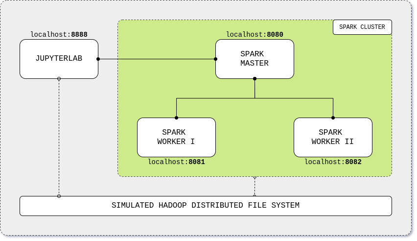

# Apache Spark Standalone Cluster on Docker
> The project just got its [own article](https://towardsdatascience.com/apache-spark-cluster-on-docker-ft-a-juyterlab-interface-418383c95445) at Towards Data Science Medium blog! :sparkles:

This project gives you an out-of-the-box **Apache Spark** cluster in standalone mode with a **JupyterLab** interface and a simulated **Apache Hadoop Distributed File System**, all built on top of **Docker**. Learn Apache Spark through its Python API, **PySpark**, by running the [Jupyter notebooks](build/workspace/pyspark.ipynb) with examples on how to read, process and write data.

<p align="center"></p>


## TL;DR

```bash
curl -LO https://raw.githubusercontent.com/andre-marcos-perez/spark-standalone-cluster-on-docker/master/docker-compose.yml
docker-compose up
```

## Contents

- [Quick Start](#quick-start)
- [Tech Stack Version](#tech-stack-version)
- [Contributing](#contributing)
- [Docker Hub Metrics](#docker-hub-metrics)
- [Contributors](#contributors)

## <a name="quick-start"></a>Quick Start

### Cluster overview

| Application                | URL                                      | Description                                                |
| -------------------------- | ---------------------------------------- | ---------------------------------------------------------- |
| **JupyterLab**             | [localhost:8888](http://localhost:8888/) | Cluster interface with PySpark built-in notebook           |
| **Apache Spark Master**    | [localhost:8080](http://localhost:8080/) | Spark Master node                                          |
| **Apache Spark Worker I**  | [localhost:8081](http://localhost:8081/) | Spark Worker node with 1 core and 512m of memory (default) |
| **Apache Spark Worker II** | [localhost:8082](http://localhost:8082/) | Spark Worker node with 1 core and 512m of memory (default) |

### Build from DockerHub

1. Install [Docker and Docker Compose](https://docs.docker.com/get-docker/), check **infra** [supported versions](#tech-stack-version);
2. Download the source code or clone the repository;
3. Edit the [docker compose](docker-compose.yml) file with your favorite tech stack version, check **apps** [supported versions](#tech-stack-version);
4. Build the cluster;

```bash
docker-compose up
```

5. Run Apache Spark code using the provided [Jupyter notebook](build/workspace/pyspark.ipynb) with PySpark examples.

### Build from your local machine

> **Note**: Local build is currently only supported on Linux OS distributions.

1. Install [Docker and Docker Compose](https://docs.docker.com/get-docker/), check **infra** [supported versions](#tech-stack-version);
2. Download the source code or clone the repository;
3. Move to the build directory;

```bash
cd build
```

4. Edit the [build.yml](build/build.yml) file with your favorite tech stack version;
5. Match those version on the [docker compose](build/docker-compose.yml) file;
6. Make the build script executable;

```bash
chmod +x build.sh
```

7. Build the images;

```bash
./build.sh
```

8. Build the cluster;

```bash
docker-compose up
```

9. Run Apache Spark code using the provided [Jupyter notebook](build/workspace/pyspark.ipynb) with PySpark examples.

## <a name="tech-stack-version"></a>Tech Stack Version

- Infrastructure

| App                | Version            |
| ------------------ | ------------------ |
| **Docker**         | 1.13.0+            |
| **Docker Compose** | 3.0+               |

- Applications

| App                | Version                 | Latest             |
| ------------------ | ----------------------  | ------------------ |
| **Apache Spark**   | 2.4.0 \| 2.4.4 \| 3.0.0 | 3.0.0              |
| **Apache Hadoop**  | 2.7                     | 2.7                |
| **JupyterLab**     | 2.1.4                   | 2.1.4              |

- Tech

| App                | Version            |
| ------------------ | ------------------ |
| **Python**         | 3.7                |
| **Scala**          | 2.12               |

## <a name="contributing"></a>Contributing

We'd love some help. To contribute, please read [this file](CONTRIBUTING.md).

## <a name="docker-hub-metrics"></a>Docker Hub Metrics

| Image                                                              | Latest Version Size                                                                                 | Pulls                                                                     |
| ------------------------------------------------------------------ | --------------------------------------------------------------------------------------------------- | ------------------------------------------------------------------------- |
| **[JupyterLab](https://hub.docker.com/r/andreper/jupyterlab)**     |     |    |
| **[Spark Master](https://hub.docker.com/r/andreper/spark-master)** |  |  |
| **[Spark Worker](https://hub.docker.com/r/andreper/spark-worker)** |  |  |

## <a name="contributors"></a>Contributors

 - **André Perez** - [dekoperez](https://twitter.com/dekoperez) - andre.marcos.perez@gmail.com